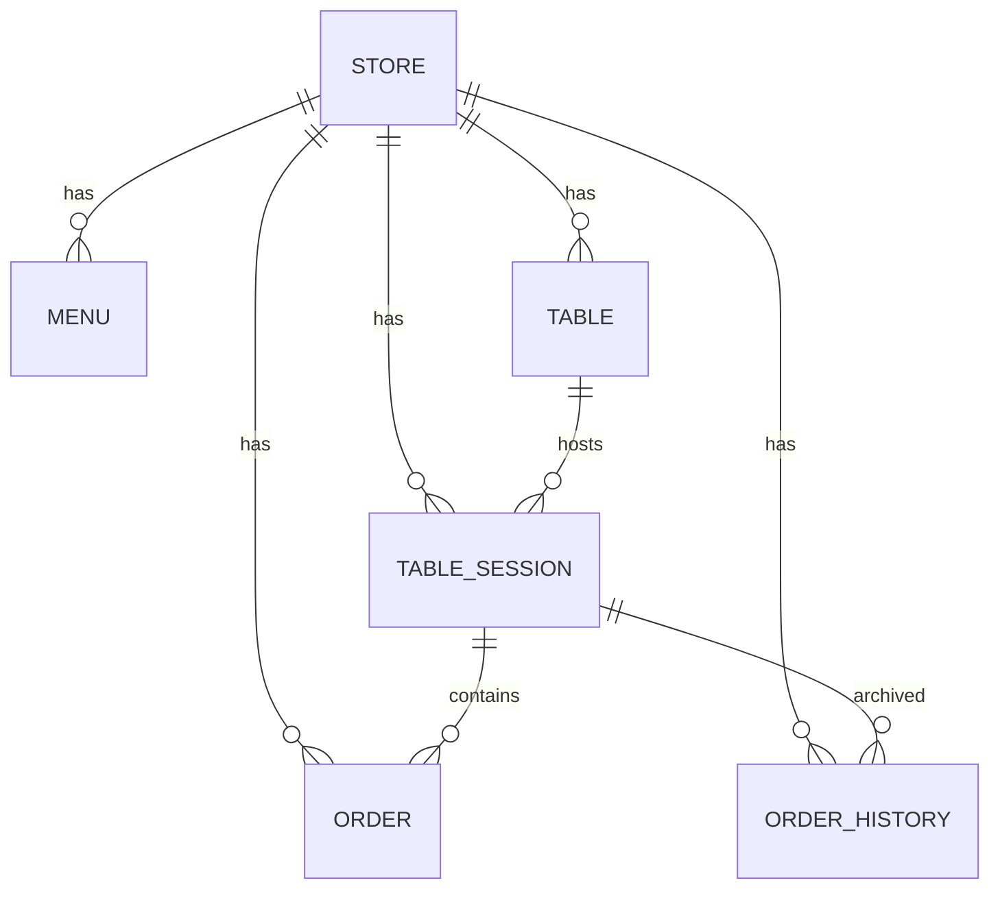

# Domain Entities — U1 backend-core (공용 도메인 모델)

**단계**: CONSTRUCTION → Functional Design
**결정 반영**: DB=PostgreSQL, PK=UUID, 삭제=소프트(deleted_at), 시간=UTC 저장, 테넌트=store_id 스코프
**성격**: 기술 중립 도메인 모델. 물리 타입(SQLAlchemy/DDL)은 Code Generation에서 구체화.

> 모든 엔티티는 `store_id`로 테넌트 스코프된다(Store 자신 제외). 모든 조회/변경은 store_id 필터를 통과. `[SEC-08][PBT-03]`
> 모든 식별자는 UUID(v4) 문자열. 시간 필드는 UTC 저장(timezone-aware).

---

## ER 개요

---

## Store (매장 / 테넌트)
| 필드 | 타입 | 제약 | 설명 |
|------|------|------|------|
| id | UUID | PK | 매장 식별자 |
| store_code | string | unique, 필수 | 로그인/자동로그인용 매장 코드 |
| name | string | 필수 | 매장명 |
| admin_username | string | 필수, (store_code,username) unique | 관리자 계정 |
| admin_password_hash | string | 필수 | bcrypt 해시 `[SEC-12]` |
| created_at | datetime(UTC) | 필수 | 생성 시각 |

## Menu (메뉴)
| 필드 | 타입 | 제약 | 설명 |
|------|------|------|------|
| id | UUID | PK | |
| store_id | UUID | FK Store, 필수, 인덱스 | 테넌트 스코프 |
| name | string | 필수 | 메뉴명 |
| price | integer(원) | ≥ 0, 상한 제약 | 단가 `[PBT-03]` |
| description | text | 선택 | 설명 |
| category | string | 필수 | 카테고리 |
| image_url | string(URL) | 선택, URL 형식 | 이미지(업로드 없음) |
| display_order | integer | 기본 0 | 노출 순서 |
| deleted_at | datetime(UTC) | nullable | 소프트 삭제 `[SEC-13]` |
| created_at | datetime(UTC) | 필수 | |

## Table (테이블)
| 필드 | 타입 | 제약 | 설명 |
|------|------|------|------|
| id | UUID | PK | |
| store_id | UUID | FK Store, 필수, 인덱스 | |
| table_no | string/int | 필수, (store_id,table_no) unique | 테이블 번호 |
| table_password_hash | string | 필수 | 태블릿 자동 로그인용 해시 `[SEC-12]` |
| created_at | datetime(UTC) | 필수 | |

## TableSession (테이블 세션)
| 필드 | 타입 | 제약 | 설명 |
|------|------|------|------|
| id | UUID | PK | 세션 식별자 |
| store_id | UUID | FK Store, 필수, 인덱스 | |
| table_id | UUID | FK Table, 필수 | |
| status | enum(active/closed) | 필수, 기본 active | 세션 상태 |
| session_token | string | 필수, unique | 고객 자동 로그인 세션 토큰(서버 검증) |
| started_at | datetime(UTC) | 필수 | 세션 시작(첫 주문) |
| closed_at | datetime(UTC) | nullable | 이용 완료 시각 |

> 제약: 테이블당 active 세션은 최대 1개(부분 unique 인덱스: store_id+table_id where status=active).

## Order (주문 — 현재 세션)
| 필드 | 타입 | 제약 | 설명 |
|------|------|------|------|
| id | UUID | PK | 내부 식별자 |
| store_id | UUID | FK Store, 필수, 인덱스 | |
| table_id | UUID | FK Table, 필수 | |
| session_id | UUID | FK TableSession, 필수 | 세션 귀속 |
| order_no | integer | 세션 내 순번(1,2,3…) | 사용자 표시용 |
| items | JSON | 필수, 비어있지 않음 | `[{menu_id,name,unit_price,qty}]` 스냅샷 |
| total | integer(원) | = Σ(unit_price×qty) | 총액 `[PBT-03]` |
| status | enum(pending/preparing/done) | 필수, 기본 pending | 주문 상태 |
| deleted_at | datetime(UTC) | nullable | 소프트 삭제(직권) `[SEC-13]` |
| created_at | datetime(UTC) | 필수 | 주문 시각 |

> items는 주문 시점의 메뉴명·단가 **스냅샷**(이후 메뉴 변경·삭제와 무관하게 주문 무결성 유지).

## OrderHistory (과거 주문 — 이용 완료 후)
- Order와 **동형 필드** + 다음 추가:
| 필드 | 타입 | 설명 |
|------|------|------|
| moved_at | datetime(UTC) | 이력 이관 시각 |
| session_closed_at | datetime(UTC) | 세션 종료(이용 완료) 시각 |
| original_order_id | UUID | 원 Order.id 참조(추적) |

> 이용 완료 시 세션의 Order 레코드를 OrderHistory로 이관(복사 후 원본 정리). 상세 로직은 U4 order 단위 Functional Design.

---

## 인덱스/성능 요약
- 모든 테넌트 테이블: `store_id` 인덱스(스코프 조회 최적화).
- Order: `(store_id, table_id, session_id)`, `(store_id, status)`.
- TableSession: 부분 unique `(store_id, table_id) where status=active`.
- OrderHistory: `(store_id, table_id, session_closed_at)`.

## 확장 매핑
- `[SEC-08]` 모든 엔티티 store_id 스코프 / UUID PK로 추측 완화.
- `[SEC-12]` 비밀번호·테이블 비밀번호 bcrypt 해시.
- `[SEC-13]` 소프트 삭제로 감사·복구.
- `[PBT-03]` price·total 불변식 대상.
