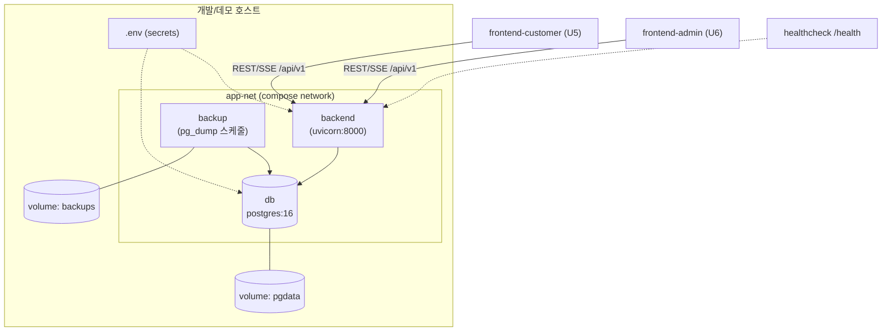
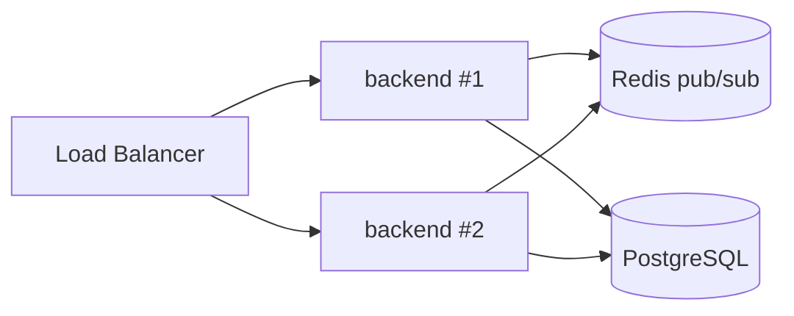

# Deployment Architecture — U1 backend-core

**단계**: CONSTRUCTION → Infrastructure Design
**환경**: 로컬 docker-compose 단일 환경 (Q1=A)

---

## 1. 배포 토폴로지

## 2. 서비스 정의 개요 (docker-compose.yml, 루트)
| 서비스 | 역할 | 핵심 설정 |
|--------|------|-----------|
| `db` | PostgreSQL 16 | volume `pgdata`, `env_file: .env`, healthcheck `pg_isready` |
| `backend` | FastAPI/uvicorn | build ./backend, `depends_on: db(condition: service_healthy)`, healthcheck `/health`, restart: unless-stopped, ports 8000 |
| `backup` | pg_dump 스케줄 | build/postgres client, `depends_on: db`, volume `backups`, 크론/entrypoint 루프 |

> 프론트 서비스(U5/U6)는 해당 단위에서 compose에 추가.

## 3. 시작 순서 & 헬스 게이팅
1. `db` 기동 → `pg_isready` healthy 대기
2. `backend` 기동 (db healthy 조건) → Alembic 마이그레이션 실행(entrypoint) → uvicorn 시작
3. `/health/deep`로 DB 연결 확인
4. `backup` 스케줄 루프 시작

## 4. 배포·롤백 절차 (RES-04)
| 동작 | 절차 |
|------|------|
| 배포 | 이미지 태그 빌드(`backend:{version}`) → `docker compose up -d` |
| 마이그레이션 | 배포 시 `alembic upgrade head` (backend entrypoint) |
| 코드 롤백 | 이전 태그로 `.env`/compose 이미지 참조 변경 → `up -d` |
| 스키마 롤백 | `alembic downgrade <rev>` |
| 런북 | 상세 절차는 Build & Test 산출물(deployment runbook)에 기술 |

## 5. 환경 변수 (핵심, .env)
| 키 | 예 | 비고 |
|----|-----|------|
| `DATABASE_URL` | postgresql+psycopg://user:pass@db:5432/tableorder | 시크릿 |
| `JWT_SECRET` | (랜덤) | 시크릿, 16h 만료 |
| `POSTGRES_USER/PASSWORD/DB` | — | db 초기화 |
| `CORS_ORIGINS` | http://localhost:5173,5174 | 명시 오리진(SEC-08) |
| `DB_POOL_SIZE/MAX_OVERFLOW` | 5/10 | 튜닝 |
| `BACKUP_SCHEDULE/RETENTION` | — | RES-12 |
- `.env`는 커밋 금지, `.env.example` 제공(SEC-01).

## 6. 복원력 운영 (RES-06/07/12/14)
- **재기동**: `restart: unless-stopped` + healthcheck 실패 시 재시작.
- **우아한 종료**: uvicorn SIGTERM 처리(진행 요청·SSE 정리).
- **백업/복원 리허설**: pg_dump → 신규 볼륨 복원 검증 절차 문서화(Build&Test).

---

## 확장(수평) 시 아키텍처 변경 (RES-08, 문서화)

- 이벤트버스·레이트리밋을 Redis로 외부화, backend 무상태화 후 N 인스턴스 + LB. (현재 미도입)

---

## 확장 규칙 준수 요약
| 확장 | 판정 | 근거 |
|------|:---:|------|
| Security | ✅ | 시크릿 .env·비커밋, db 내부망, CORS 명시(SEC-01/08) |
| Resiliency | ✅ | healthcheck 게이팅·restart(RES-06), graceful(RES-07), backup(RES-12), 태그/Alembic 롤백(RES-04) |
