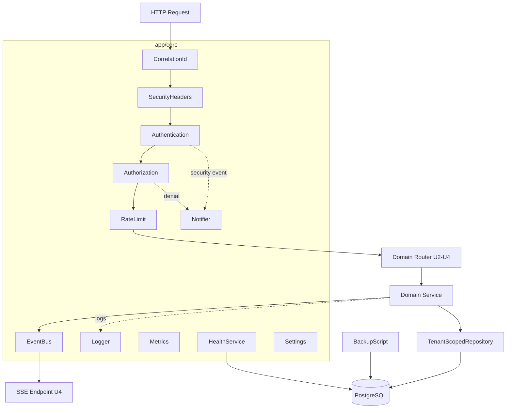

# Logical Components — U1 backend-core

**단계**: CONSTRUCTION → NFR Design
**결정**: Q7=A — 횡단 논리 컴포넌트를 `app/core/` 에 집약.

U1이 제공하는 횡단 논리 컴포넌트와 통합 패턴을 정의한다. 각 컴포넌트는 인터페이스(계약)로 기술하며 U2–U6가 소비한다.

---

## 1. 컴포넌트 인벤토리 (`app/core/`)
| 컴포넌트 | 책임 | 소비자 | 매핑 |
|----------|------|--------|------|
| **Settings** | 환경변수 로드(pydantic-settings), 시크릿·DB URL·JWT·타임아웃·풀 설정 | 전체 | NFR-M3, SEC-01 |
| **Database** | 엔진/세션 팩토리, 트랜잭션 스코프, 커넥션 풀 | Repository 전체 | NFR-S2, NFR-R3 |
| **TenantContext** | 요청별 store_id·role·session 컨텍스트(ContextVar) | 서비스·리포지토리 | SEC-08 |
| **MiddlewareStack** | CorrelationId→SecurityHeaders→Auth→Authz→RateLimit | 전체 | SEC-04/08/11 |
| **ExceptionHandler** | 중앙 예외→일반화 응답(fail-closed, 상관ID) | 전체 | SEC-03/15 |
| **EventBus** | 인메모리 pub/sub, topic별 asyncio 큐 브로드캐스트 | Order/Realtime(U4) | NFR-P2 |
| **Logger** | 구조적 JSON 로깅, 상관ID·마스킹 | 전체 | SEC-03, RES-05 |
| **Metrics** | 요청 수·지연·오류율·SSE 활성 연결 카운터 | 전체 | RES-05 |
| **HealthService** | shallow(/health)·deep(/health/deep, DB ping) | 운영/컨테이너 | RES-06 |
| **Notifier (interface)** | 보안 이벤트 알림 어댑터, 기본 구현=로그 | ExceptionHandler·Auth | SEC-14, RES-15 |
| **BackupScript** | 스케줄 pg_dump + 보존 + 복원 절차 | 운영 | RES-12, NFR-A4 |
| **TenantScopedRepository (base)** | store_id 강제 필터·소유권 검증 베이스 | 모든 도메인 리포지토리 | SEC-08, PBT-03 |

---

## 2. 컴포넌트 관계 (논리 흐름)

---

## 3. 통합 패턴
| 대상 | 통합 방식 |
|------|-----------|
| Settings → 전체 | DI(의존성 주입) 또는 모듈 싱글턴, 앱 시작 시 로드·검증 |
| Database → Repository | 요청 스코프 세션(FastAPI Depends), 트랜잭션 컨텍스트 매니저 |
| TenantContext → Repository | ContextVar로 전파, 베이스 리포지토리가 자동 필터 주입 |
| EventBus → SSE | 주문/상태 변경 시 publish, SSE 엔드포인트가 subscribe하여 스트림 |
| Notifier → 보안 이벤트 | 인터페이스 주입, 기본=LogNotifier(추후 웹훅/메일 어댑터 교체) |
| BackupScript | compose 서비스/크론으로 독립 실행, 앱과 분리 |

---

## 4. 확장(수평) 시 교체 지점 (RES-08 문서화)
| 컴포넌트 | demo(현재) | 확장 시 |
|----------|-----------|---------|
| EventBus | 인메모리 pub/sub | Redis pub/sub |
| RateLimit | 인메모리 카운터 | Redis 기반 분산 카운터 |
| Metrics | 로그/카운터 | Prometheus exporter |
| Notifier | LogNotifier | Webhook/Email/Slack 어댑터 |

---

## 확장 규칙 준수 요약
| 확장 | 판정 | 근거 |
|------|:---:|------|
| Security | ✅ | MiddlewareStack·ExceptionHandler·TenantContext·TenantScopedRepository·Notifier·Settings → SEC-01/03/04/08/11/14/15 |
| PBT | ✅ | TenantScopedRepository base가 격리 불변식 강제점(테스트 대상) → PBT-03 |
| Resiliency | ✅ | EventBus/Health/Backup/Notifier + graceful shutdown 훅 → RES-05/06/07/12/15, 확장 교체점 → RES-08 |
