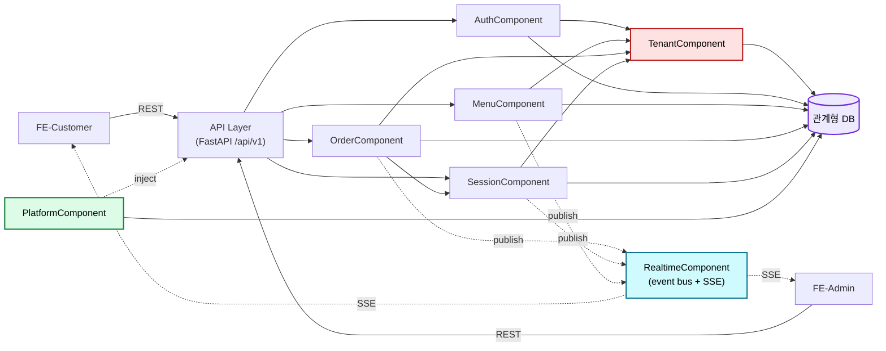

# Component Dependency — 테이블오더 서비스

**단계**: INCEPTION → Application Design
**통신 패턴**: 동기 함수 호출(같은 프로세스 모놀리스) + 인메모리 이벤트 버스(pub/sub, RealtimeComponent) + SSE(서버→클라이언트 단방향).

---

## 의존성 매트릭스
행(호출자) → 열(피호출자). ●=직접 의존, ○=이벤트(pub/sub) 경유, –=없음.

| 호출자 \ 피호출 | Auth | Menu | Order | Session | Realtime | Tenant | Platform | DB |
|---|:--:|:--:|:--:|:--:|:--:|:--:|:--:|:--:|
| **AuthComponent**    | –  | –  | –  | –  | –  | ●  | ●  | ● |
| **MenuComponent**    | –  | –  | –  | –  | ○  | ●  | ●  | ● |
| **OrderComponent**   | –  | –  | –  | ●  | ○  | ●  | ●  | ● |
| **SessionComponent** | –  | –  | ●* | –  | ○  | ●  | ●  | ● |
| **RealtimeComponent**| –  | –  | –  | –  | –  | ●  | ●  | – |
| **TenantComponent**  | –  | –  | –  | –  | –  | –  | ○  | – |
| **PlatformComponent**| –  | –  | –  | –  | –  | –  | –  | ●(health/backup) |

\* SessionComponent↔OrderComponent: 데이터 이관을 위해 OrderRepository/OrderHistoryRepository를 공유(순환 서비스 호출 방지 위해 Repository 레벨 협력).

**핵심 원칙**:
- 도메인 컴포넌트(Auth/Menu/Order/Session)는 서로 직접 순환 호출하지 않음. 협력이 필요하면 하위 Repository 또는 이벤트 버스를 통함.
- 모든 DB 접근은 TenantComponent 스코프를 통과(공유 스키마 + store_id). `[SEC-08]` `[PBT-03]`
- 횡단(Tenant/Platform)은 도메인 컴포넌트에 주입(FastAPI Depends/미들웨어).

---

## 통신 패턴별 정리
| 패턴 | 사용처 | 비고 |
|------|--------|------|
| 동기 호출 | API→Service→Repository | 요청/응답 처리 |
| 인메모리 이벤트(pub/sub) | Order/Session/Menu → Realtime | 상태 변경 브로드캐스트, 느슨한 결합 |
| SSE(단방향) | Realtime → FE-Customer/FE-Admin | 실시간 갱신, 재연결(RES-10) |
| 미들웨어/의존성 주입 | Tenant/Platform → 전 컴포넌트 | 인가·검증·로깅·헤더 |

---

## 데이터 흐름 (Mermaid)

---

## 결합/응집 평가
- **응집도**: 각 컴포넌트는 단일 도메인 책임(높은 응집).
- **결합도**: 도메인 간 결합은 이벤트 버스와 공유 Repository로 최소화(느슨).
- **위험 지점**: Order↔Session 협력(이력 이관) — Repository 공유로 순환 서비스 의존 회피. 인메모리 이벤트 버스는 단일 인스턴스 가정(다중 인스턴스 확장 시 외부 브로커로 교체 필요, execution-plan Q2=A 결정에 명시).
