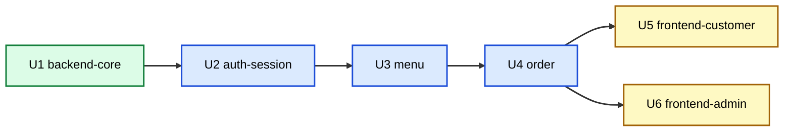

# Unit of Work Dependency — 테이블오더 서비스

**단계**: INCEPTION → Units Generation (Part 2)
**통신**: 백엔드 단위(U1~U4)는 같은 프로세스 내 모듈 호출 + 인메모리 이벤트 버스. 프론트(U5/U6)는 REST/SSE로 백엔드 소비.

---

## 의존성 매트릭스
행(의존 주체) → 열(의존 대상). ●=직접 의존, ○=API/SSE 소비, –=없음.

| 단위 \ 대상 | U1 core | U2 auth | U3 menu | U4 order |
|---|:--:|:--:|:--:|:--:|
| **U1 backend-core** | – | – | – | – |
| **U2 auth-session** | ● | – | – | – |
| **U3 menu** | ● | ●(인가) | – | – |
| **U4 order** | ● | ●(세션) | ●(단가) | – |
| **U5 frontend-customer** | – | ○ | ○ | ○ |
| **U6 frontend-admin** | – | ○ | ○ | ○ |

**관찰**:
- U1은 의존 없음 → 최우선 개발(기반).
- 백엔드 의존 방향은 단방향(순환 없음): core ← auth ← menu ← order.
- 프론트는 백엔드 API/SSE만 소비(백엔드는 프론트에 의존 안 함).

---

## 개발/빌드 순서 (Q5=A, 의존성 기반 순차)

**순서**: U1 → U2 → U3 → U4 → (U5, U6 병렬 가능).
- **크리티컬 패스**: U1 → U2 → U3 → U4 (백엔드 API가 프론트를 블록).
- **병렬 기회**: U5·U6는 U4 API 계약 확정 후 동시 개발 가능.

---

## 조정 지점 (Coordination Points)
| 지점 | 내용 |
|------|------|
| 공유 모델/스키마 | U1 `shared/`의 DB 모델·Pydantic 스키마를 U2~U4가 공용 (Q6=A) |
| 테넌트 스코프 | U1 TenantScopedRepository를 모든 도메인 리포지토리가 상속 |
| API 계약 | U2~U4의 REST/SSE 스펙 확정 후 U5·U6 착수(OpenAPI 문서 활용) |
| 이벤트 버스 | U4가 발행하는 SSE 이벤트 토픽 스키마를 U5·U6가 구독 |

## 테스트 체크포인트
- 단위별 단위 테스트 + PBT(U3 가격, U4 총액/세션/격리).
- U4 완료 후 백엔드 통합 테스트(주문→SSE→상태 변경 흐름).
- U5·U6 완료 후 e2e 성격의 통합(프론트↔백엔드) 검증. (상세는 Build and Test 단계)

## 롤백 전략
- 그린필드·로컬 docker-compose → 단위별 커밋 격리, 실패 시 해당 단위 재작업. DB는 Alembic 마이그레이션 되돌림 + 백업(RES-12) 복원.
