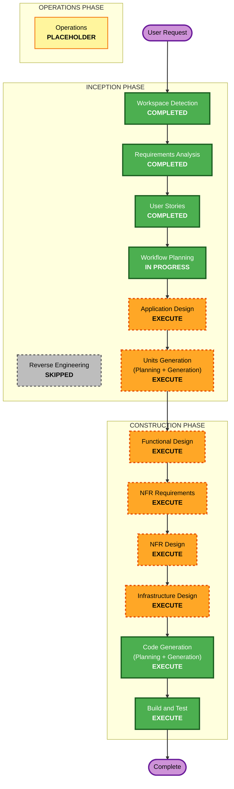

# Execution Plan — 테이블오더 서비스

**단계**: INCEPTION → Workflow Planning
**프로젝트 유형**: Greenfield (신규)
**입력**: `requirements.md`, `stories.md`(33 스토리/5 Epic), `personas.md`(고객·관리자)

---

## 상세 분석 요약 (Detailed Analysis Summary)

### 변경 영향 평가 (Change Impact Assessment)
- **User-facing changes**: Yes — 고객 태블릿 UI + 관리자 웹 UI 신규 구축 (React/Vite)
- **Structural changes**: Yes — 백엔드(FastAPI) + 프론트엔드(React) + DB(관계형) 신규 아키텍처, 멀티테넌시 구조
- **Data model changes**: Yes — 신규 스키마 전체 (Store, Menu, Table, TableSession, Order, OrderHistory)
- **API changes**: Yes — 인증·메뉴·주문·세션·SSE 엔드포인트 신규 정의
- **NFR impact**: Yes — 3개 확장(보안/복원력/PBT) 전면 적용, SSE 실시간, JWT/bcrypt 인증

### 위험 평가 (Risk Assessment)
- **Risk Level**: Medium — 신규 그린필드로 롤백 부담은 낮으나, 멀티테넌시 격리·실시간 SSE·3개 확장 규칙 동시 적용으로 설계 복잡도 존재
- **Rollback Complexity**: Easy — 신규 프로젝트, 로컬 docker-compose 배포
- **Testing Complexity**: Complex — 단위 + 통합 + 속성 기반 테스트(Hypothesis) + 보안/격리 검증

---

## 워크플로우 시각화 (Workflow Visualization)

---

## 실행할 단계 (Phases to Execute)

### 🔵 INCEPTION PHASE
- [x] Workspace Detection (COMPLETED)
- [x] Reverse Engineering (SKIPPED — 그린필드, 기존 코드 없음)
- [x] Requirements Analysis (COMPLETED)
- [x] User Stories (COMPLETED — 33 스토리 / 5 Epic)
- [x] Workflow Planning (IN PROGRESS)
- [ ] **Application Design — EXECUTE**
  - **Rationale**: 신규 컴포넌트/서비스(인증·메뉴·주문·세션 서비스) 정의 필요, 컴포넌트 메서드·비즈니스 규칙·의존성 명세 필요
- [ ] **Units Generation — EXECUTE**
  - **Rationale**: 백엔드/프론트엔드/DB 등 다중 모듈로 구성, 도메인별(인증/메뉴/주문/세션) 작업 단위 분해 필요

### 🟢 CONSTRUCTION PHASE (각 Unit별 반복)
- [ ] **Functional Design — EXECUTE**
  - **Rationale**: 신규 데이터 모델(6개 엔티티)·세션 라이프사이클·총액 계산 등 복잡 비즈니스 로직 상세 설계 필요
- [ ] **NFR Requirements — EXECUTE**
  - **Rationale**: 보안·복원력·PBT 확장 전면 적용, 실시간(SSE) 성능·JWT/bcrypt 보안 요구 존재
- [ ] **NFR Design — EXECUTE**
  - **Rationale**: NFR 요구를 패턴으로 반영 필요. 유보 항목(RESILIENCY-04 CI/CD·롤백, RESILIENCY-08 리전 토폴로지, RESILIENCY-14 복원력 테스트) 여기서 확정
- [ ] **Infrastructure Design — EXECUTE**
  - **Rationale**: 로컬 docker-compose 배포 아키텍처(백엔드·프론트·DB 컨테이너, 헬스체크, 백업) 명세 필요
- [ ] **Code Generation — EXECUTE (ALWAYS)**
  - **Rationale**: 구현 계획 및 코드/테스트 생성
- [ ] **Build and Test — EXECUTE (ALWAYS)**
  - **Rationale**: 빌드·단위·통합·속성 기반 테스트 지침 및 검증

### 🟡 OPERATIONS PHASE
- [ ] Operations — PLACEHOLDER (향후 배포/모니터링 워크플로우)

---

## 예상 작업 단위 (Units — 잠정, Units Generation에서 확정)
1. **backend-core** — FastAPI 앱, 공통(멀티테넌시 미들웨어, 인증, 로깅, 헬스체크, 보안 헤더)
2. **auth-session** — 매장 인증(JWT/bcrypt), 테이블 세션/자동 로그인
3. **menu** — 메뉴 CRUD·카테고리·노출 순서
4. **order** — 장바구니→주문 확정, 주문 상태, 세션 이력, SSE 실시간
5. **frontend-customer** — 고객 태블릿 UI (React/Vite)
6. **frontend-admin** — 관리자 대시보드 UI (React/Vite, SSE)

> 위 단위 구성은 Units Generation 단계에서 최종 확정합니다.

---

## 성공 기준 (Success Criteria)
- **Primary Goal**: 멀티테넌트 테이블오더 서비스(고객 주문 + 관리자 실시간 운영)를 로컬 docker-compose로 동작 가능하게 구현
- **Key Deliverables**: FastAPI 백엔드, React 고객/관리자 프론트엔드, 관계형 DB 스키마, SSE 실시간, docker-compose
- **Quality Gates**:
  - 33개 사용자 스토리의 수용 기준(Gherkin) 충족
  - 보안 확장(SECURITY-01~15) 준수 — 인증·격리·입력검증·헤더
  - PBT 확장(Hypothesis) — 총액/세션/격리 불변식 속성 테스트 통과
  - 복원력 확장 — 헬스체크·백업·그레이스풀 디그레이드·SSE 재연결

---

## 확장 규칙 준수 요약 (Extension Compliance — Workflow Planning 단계)
| 확장 | 적용 여부 | 판정 근거 |
|------|:---:|------|
| Security Baseline | N/A (계획 단계) | 계획 산출물에는 직접 코드/설정 없음. CONSTRUCTION 단계에서 강제 |
| Property-Based Testing | N/A (계획 단계) | 테스트 대상 코드 없음. Functional/NFR/Code Gen에서 강제 |
| Resiliency Baseline | 부분 적용 | 위험·롤백·테스트 복잡도 평가에 반영. 세부(RESILIENCY-04/08/14)는 NFR Design에서 확정 |

계획 단계에서 확장 규칙은 직접적인 코드 산출물이 없어 대부분 N/A이며, 관련 결정은 후속 단계로 명시적으로 전달됩니다(비차단).
